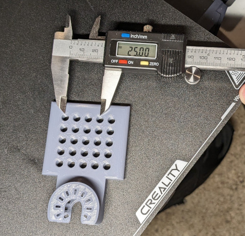
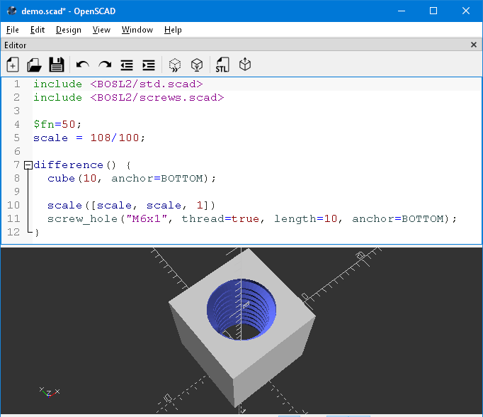
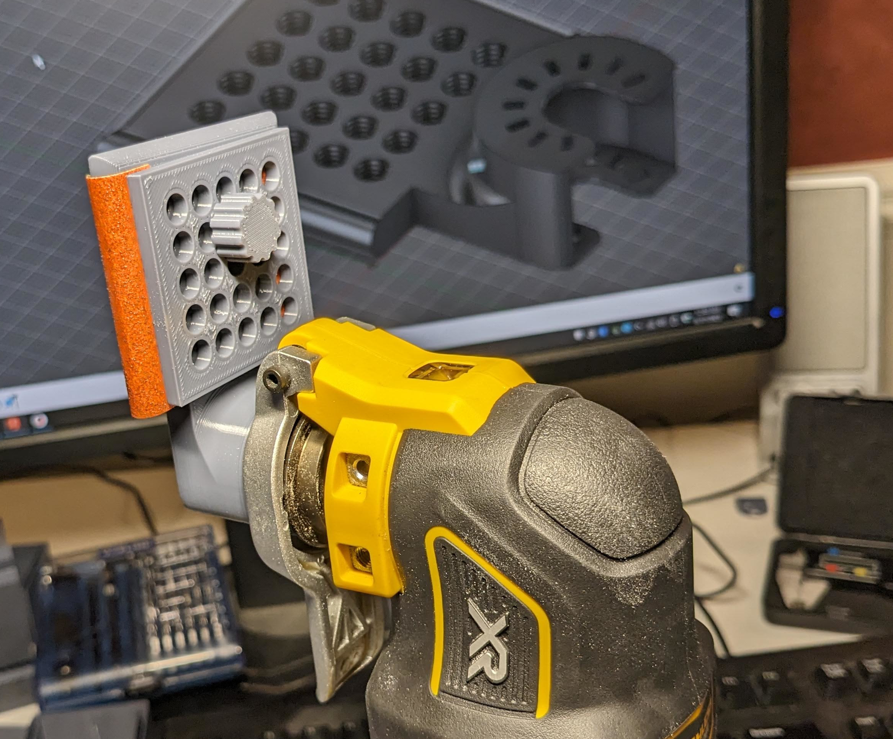

# Everclamp: solving the thread printing problem

## Specification

The Everclamp specification defines the following rectangular array of threaded holes:

- Thread pattern: **M6x1**
- Grid spacing: **25/3 mm** (8.333 mm) center to center

## Github repo

[https://github.com/pmarks-net/everclamp/](https://github.com/pmarks-net/everclamp/)

## Why would anyone want a dense array of threaded holes?

For clamping stuff wherever.

I was trying to make a [multi-tool to sandpaper adapter](https://www.thingiverse.com/thing:6083263), thinking of all the ways one might attach sandpaper to a solid block.  The general solution is to squeeze two flat plates together like a clamp.  But where to put the threads, when there might be sandpaper in the way?  Well, we have 3D printers now, so let's print threads everywhere and figure out the rest at runtime.

My point is not that a dense array of threaded holes is incredibly useful, but it is *mildly* useful, and in order to use one I had to define a grid, hence the Everclamp standard.  If you make an object with ~6mm holes spaced by some multiple of 25/3 mm, then it can clamp to an oscillating multi-tool, or whatever else someone makes an adapter for.

## Why M6 threads?

Let's see what the metric system has to offer:

| Bolt Size | Thread Pitch (mm) | Thread Diameter (mm) | Tensile Stress Area (mm^2)|
|-----------|-------------------|----------------------|---------------------|
| M3        | 0.5               | 3                    | 5.0                 |
| M4        | 0.7               | 4                    | 8.8                 |
| M5        | 0.8               | 5                    | 14.2                |
| **M6**    | **1**             | **6**                | **20.1**            |
| M7        | 1                 | 7                    | 28.9                |
| M8        | 1.25              | 8                    | 36.6                |

The main use case is 3D printing with layer heights around 0.2 mm, so a thread pitch below 1 mm is not reliable.  M6 is the smallest size with a 1 mm pitch, and also provides enough area for light duty plastic thumbscrews.

## Why 25/3 mm?

The densest possible spacing for an array of M6 holes is about 8 mm, so we're looking for a number in that ballpark.  10 mm is not dense enough for clamping wherever.

For a grid standard to make any sense in the context of the metric system, it needs to include round numbers like "100 mm".  It turns out that 25/3 = 8.333 is very close to our target density.  This spacing includes numbers like 16.6, 25, 33.3, 50, 66, 100, so it's like the megahertz race all over again.

An 8.333 mm spacing means that columns `n` and `n+3` are separated by exactly 25 mm, and `n+12` by 100 mm.  In theory, the Everclamp grid is compatible with [VESA MIS-F M6](https://en.wikipedia.org/wiki/Flat_Display_Mounting_Interface#Variants), given a large enough array.

## Calibration

These are the steps required to print M6 threads accurately:

- Buy a single M6 nut and bolt from a hardware store (if you don't have one already).  Play with them a bit, feel how they wobble and spin.

- Print [calibration_holes.stl](https://github.com/pmarks-net/everclamp/blob/main/calibration_holes.stl) and [calibration_bolts.stl](https://github.com/pmarks-net/everclamp/blob/main/calibration_bolts.stl) using the same printer/slicer settings you plan to use for your final threaded object.

- Try threading the M6 bolt into the 100% hole, moving up/down in size until you find one that fits like the M6 nut.  In the photo below, my bolt is in the 108% hole, so I need to print with `m6_hole_scale_xy = 108/100;`

- Try threading the M6 nut over the 100% bolt, moving up/down in size until you find one that fits like the M6 bolt.  In the photo below, my nut is on the 96% bolt, so I need to print with `m6_bolt_scale_xy = 96/100;`.  (If you want to spread out the bolts, you can flex or cut the base, or [edit the model](https://github.com/pmarks-net/everclamp/blob/main/calibration_bolts.scad).)

If you already have a `*.bundle.scad` file that refers here, then the remaining steps are:

- Install OpenSCAD from https://openscad.org/
- Open the `*.bundle.scad` file
- At the top, edit `m6_hole_scale_xy` or `m6_bolt_scale_xy` to match your calibrated value
- Click `Save`, then `Preview` (you should be able to see the model and threads)
- Click `Render` (might be slow)
- Click `Export to STL`
- Print
- Enjoy threads

## How to share 3D models with thread calibration

Suppose you want to create and share a 3D model that includes threads. It is not possible to make a single STL file that works for everyone, but what if you could share a model with *adjustable threads*?

Well, if the model is completely designed in OpenSCAD, this is straightforward:

I also found a [janky way to scale threads in Fusion360](fusion360), but my point is not to list workarounds for every piece of software. If we wish to solve the thread printing problem in general, then the solution must work with any design tool.

Here's what to do instead:

- Deisgn your model in whatever software you want, but omit the threads
- Export to STL
- Convert the STL to OpenSCAD geometry
- Write OpenSCAD code to cut threads where you want them.  SCAD cannot "query" the STL model, so you will need to hard-code a few coordinates.
- Bundle up the STL, SCAD, and SCAD libraries into one `.bundle.scad` file
- Distribute that file
- A "user" only has to install OpenSCAD (no libraries), edit 1 line of code, and render the model.

Here is code that solves most of these problems: [https://github.com/pmarks-net/everclamp/blob/main/bundle_scad/](https://github.com/pmarks-net/everclamp/blob/main/bundle_scad/)

[everclamp_thread_cutter.scad](https://github.com/pmarks-net/everclamp/blob/main/bundle_scad/everclamp_thread_cutter.scad) demonstrates the same pattern as the screenshot above: `difference() { /*some object*/; /*threads*/; }`.  When using [bundle_scad.py](https://github.com/pmarks-net/everclamp/blob/main/bundle_scad/bundle_scad.py) with `import <foo.stl.scad>`, replace the `cube()` with `stl_blob()`.

Note that this does not work with Thingiverse Customizer because their OpenSCAD version is too old for BOSL2: `text(str(version()));` reports `[2015, 3, 0]`. Though it may be possible using a screw threads library with pre-2015 syntax.

## Example

This [5x5 Everclamp](https://www.thingiverse.com/thing:6083263) attaches to an oscillating multitool, using a 5x5 sqwasher and thumbscrews to hold sandpaper, a sponge, etc.:

