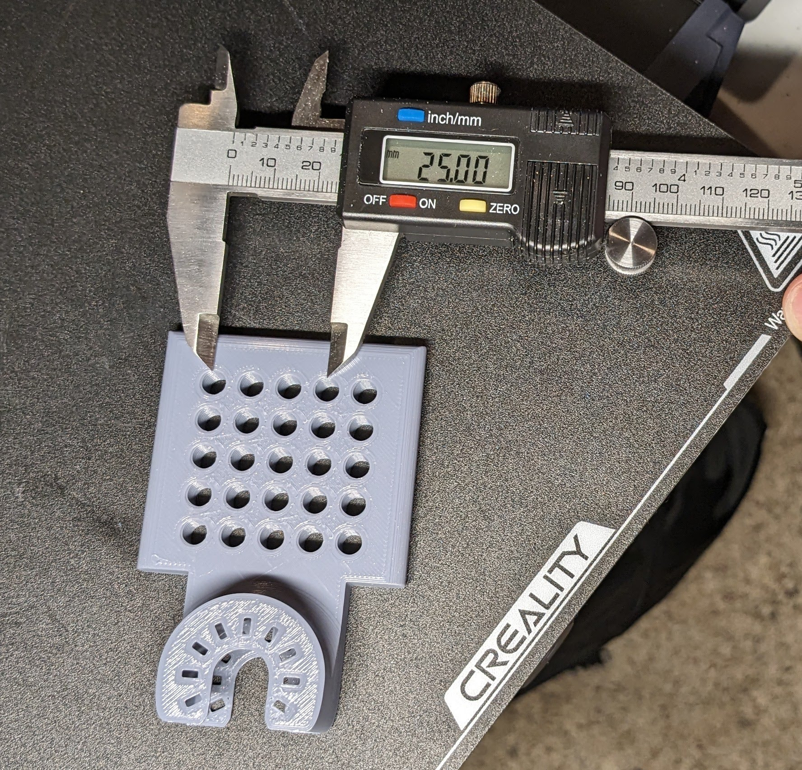
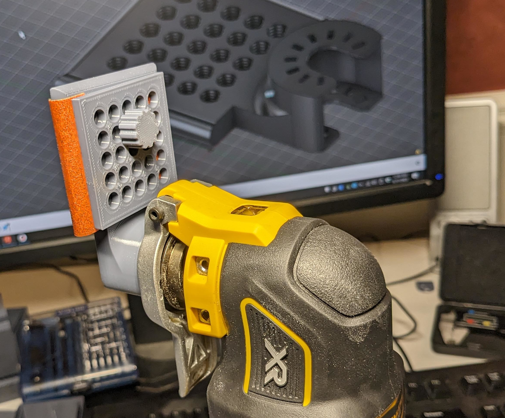

## Specification

The Everclamp specification defines the following rectangular array of threaded holes:

- Thread pattern: **M6x1**
- Grid spacing: **25/3 mm** (8.333 mm) center to center

## Why these values?
M6 bolts have a 1mm thread pitch, which is just coarse enough to practically 3D print threaded holes and thumbscrews.  The densest possible spacing for such an array is about 8mm, so we choose a nearby value that aligns nicely with metric grids like 100x100 mm.

The 8.333 mm spacing means that columns `n` and `n+3` are separated by exactly 25 mm.  In theory, Everclamp is compatible with [VESA MIS-F M6](https://en.wikipedia.org/wiki/Flat_Display_Mounting_Interface#Variants) given a large enough array.



## Example

This [5x5 Everclamp](https://www.thingiverse.com/thing:6083263) attaches to an oscillating multitool, using a 5x5 sqwasher and thumbscrews to hold sandpaper in any orientation:


## Calibration

Always use an off-the-shelf M6 nut and bolt for tolerance calibration when 3D printing Everclamp-compatible threads.

When I create M6x1 threads in Fusion360, the holes print too tight.  My solution is a bit janky, but it works:

- Search `%localappdata%\Autodesk` for the `ISOMetricprofile.xml` file.  See [this article](https://www.autodesk.com/support/technical/article/caas/sfdcarticles/sfdcarticles/Custom-Threads-in-Fusion-360.html) for details.

- Find this section:

```
  <ThreadSize>
    <Size>6.0</Size>
    <Designation>
      <ThreadDesignation>M6x1</ThreadDesignation>
      <CTD>M6x1</CTD>
      <Pitch>1.0</Pitch>
      ...
      <Thread>
        <Gender>internal</Gender>
        <Class>6H</Class>
        <MajorDia>6.147</MajorDia>
        <PitchDia>5.425</PitchDia>
        <MinorDia>5.035</MinorDia>
        <TapDrill>5.0</TapDrill>
      </Thread>
```

- Insert these scaled-up alternatives:

```
      <Thread>
        <Gender>internal</Gender>
        <Class>6H x 102%</Class>
        <MajorDia>6.270</MajorDia>
        <PitchDia>5.534</PitchDia>
        <MinorDia>5.136</MinorDia>
        <TapDrill>5.100</TapDrill>
      </Thread>
      <Thread>
        <Gender>internal</Gender>
        <Class>6H x 105%</Class>
        <MajorDia>6.454</MajorDia>
        <PitchDia>5.696</PitchDia>
        <MinorDia>5.287</MinorDia>
        <TapDrill>5.250</TapDrill>
      </Thread>
      <Thread>
        <Gender>internal</Gender>
        <Class>6H x 108%</Class>
        <MajorDia>6.639</MajorDia>
        <PitchDia>5.859</PitchDia>
        <MinorDia>5.438</MinorDia>
        <TapDrill>5.400</TapDrill>
      </Thread>      
```
